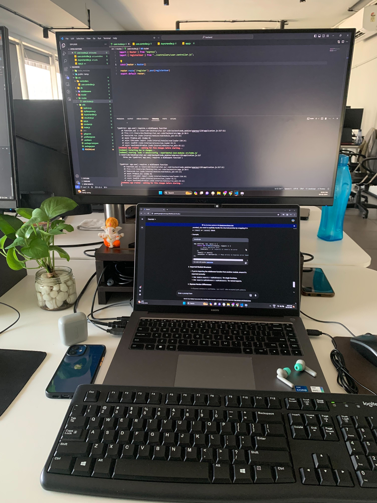

# Hi, I'm Shubham Kadam

A  Full Stack developer from India, based in Mumbai. 

## About Me

[](mailto:shelterk1120@gmail.com)
[](https://www.linkedin.com/in/shubham-kadam-248b65233)
## Tools

<a href="https://github.com" target="_blank">  </a> <a href="https://code.visualstudio.com/" target="_blank">  </a> <a href="https://obsidian.md/" target="_blank">  </a> <a href="https://www.centos.org/" target="_blank">  </a> <a href="https://postman.com" target="_blank" rel="noreferrer">  </a> <a href="https://postman.com" target="_blank" rel="noreferrer">  </a>

## Technology Stack

<a href="https://www.djangoproject.com/" target="_blank" rel="noreferrer">  </a> <a href="https://www.docker.com/" target="_blank" rel="noreferrer">  </a> <a href="https://www.elastic.co" target="_blank" rel="noreferrer">  </a> <a href="https://flask.palletsprojects.com/" target="_blank" rel="noreferrer">  </a> <a href="https://git-scm.com/" target="_blank" rel="noreferrer">  </a> <a href="https://golang.org" target="_blank" rel="noreferrer">  </a> <a href="https://grafana.com" target="_blank" rel="noreferrer">  </a>   </a> <a href="https://www.mysql.com/" target="_blank" rel="noreferrer">  </a> <a href="https://www.nginx.com" target="_blank" rel="noreferrer">  </a> <a href="https://www.python.org" target="_blank" rel="noreferrer">  </a> <a href="https://www.rabbitmq.com" target="_blank" rel="noreferrer">  </a> <a href="https://redis.io" target="_blank" rel="noreferrer">  </a> 

## My Workspace

<div align="center">
  <h2>My Workspace</h2>
  

  <blockquote>
    <p><i style="background-color":white>Programming isn’t about what you know; it’s about what you can figure out.</i></p>
  </blockquote>
</div>

**🐱 My GitHub Data** 

> 🏆 2 Contributions in the Year 2024
 > 
> 📦 99.6 kB Used in GitHub's Storage  
 > 
> 📜 4 Public Repositories 
 > 
> 🔑 3 Private Repositories  
 > 
**I'm an Early 🐤** 

```text
🌞 Morning          ██░░░░░░░░░░░░░░░░░░░░░░░   7.69% 
🌆 Daytime          █████████████░░░░░░░░░░░░   53.85% 
🌃 Evening          ░░░░░░░░░░░░░░░░░░░░░░░░░   0.0%
🌙 Night            █████████░░░░░░░░░░░░░░░░   38.46% 

```
📅 **I'm Most Productive on Saturday** 

```text
Monday       2 commits      ██░░░░░░░░░░░░░░░░░░░░░░░   7.69% 
Tuesday      1 commits      █░░░░░░░░░░░░░░░░░░░░░░░░   3.85% 
Wednesday    4 commits      ███░░░░░░░░░░░░░░░░░░░░░░   15.38% 
Thursday     6 commits      █████░░░░░░░░░░░░░░░░░░░░   23.08% 
Friday       1 commits      █░░░░░░░░░░░░░░░░░░░░░░░░   3.85% 
Saturday     9 commits      ████████░░░░░░░░░░░░░░░░░   34.62% 
Sunday       3 commits      ███░░░░░░░░░░░░░░░░░░░░░░   11.54%

```


📊 **This Week I Spent My Time On** 

```text
💬 Programming Languages: 
Javascript               0 secs           ███████████████████████░░   93.53% 
python                   0 secs           █████████░░░░░░░░░░░░░░░░   38.46%                  
Docker                   0 secs           ░░░░░░░░░░░░░░░░░░░░░░░░░   1.47%

🔥 Editors: 
VSCODE                  0 secs            █████████████████████████   100.0%

💻 Operating System: 
Mac                      0 secs            █████████████████████████   100.0%

```

**I Mostly Code in Javascript** 

```text
React                   8 repos              ██████████████░░░░░░░░░░░   57.14% 
Nodejs                  3 repos           █████░░░░░░░░░░░░░░░░░░░░   21.43% 


```


 Last Updated on 27/09/2024
