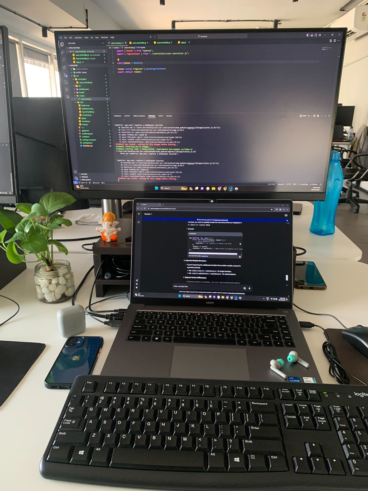

# Hi, I'm Shubham Kadam

A  Full Stack developer from India, based in Mumbai. 

## About Me

## Tools

     

## Technology Stack

## My Workspace

  <h2>My Workspace</h2>
  

  <blockquote>
    
<i style="background-color":white>Programming isn’t about what you know; it’s about what you can figure out.</i>

  </blockquote>

